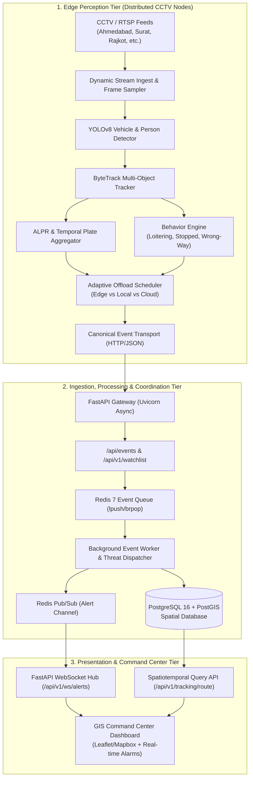

# Sentinel Video Intelligence Platform — Architecture Blueprint & System Context

> **Gujarat Police CCTV Integration Hackathon**  
> *Next-Generation Statewide Edge-Cloud AI Surveillance & Geospatial Intelligence Platform*

---

## 1. Executive Summary & Mission

The **Sentinel Video Intelligence Platform** is an enterprise-grade, distributed AI video analytics and geospatial tracking system architected specifically for the **Gujarat Police CCTV Integration Hackathon**. 

Historically, urban and highway surveillance initiatives have relied on fragmented, per-city monolithic scripts (e.g., isolated Ahmedabad, Surat, and Rajkot implementations) with hardcoded credentials, brittle camera feeds, and zero unified coordination. **Sentinel** replaces this legacy paradigm with a resilient, high-throughput, edge-to-cloud computing pipeline designed to process real-time feeds across thousands of CCTV cameras statewide.

### Core Objectives
1. **Low-Latency Edge Perception**: Run lightweight deep-learning inference (YOLOv8 + ByteTrack) on distributed edge nodes at junctions, toll plazas, and checkpoints.
2. **Deterministic & Adaptive Offloading**: Dynamically route heavy workloads (dense ALPR, OCR, behavior analysis) between Edge, Local GPU servers, and Cloud nodes based on real-time node telemetry.
3. **Statewide Geospatial Intelligence**: Ingest events into a PostGIS-enabled spatiotemporal database to instantly reconstruct vehicle trajectories, pinpoint suspects, and detect movement anomalies.
4. **Real-Time Threat Dispatch**: Push critical alerts (wanted vehicles, stolen cars, suspicious loitering) via Redis pub/sub and WebSockets to the GIS Command Center in under 100 milliseconds.

---

## 2. End-to-End System Architecture

Sentinel follows a decoupled, three-tier distributed topology:



---

## 3. Core Technology Stack & Component Breakdown

### 3.1 Edge Perception Tier (`edge/sentinel_edge`)
- **YOLOv8 + ByteTrack**: Real-time object detection recognizing vehicles (`car`, `truck`, `bus`, `motorcycle`) and pedestrians (`person`) paired with ByteTrack for persistent ID tracking across consecutive frames.
- **ALPR Engine (`sentinel_edge.alpr`)**: Automatic License Plate Recognition with two-stage detection and optical character recognition (OCR), regex validation for Indian High Security Registration Plates (HSRP - e.g., `GJ01AB1234`), and a temporal majority-voting aggregator (`TemporalPlateAggregator`) to eliminate optical jitter.
- **Behavior Engine (`sentinel_edge.behavior`)**: Vector-based spatial rule evaluation analyzing loitering patterns, abnormal stationary stops in restricted zones, rapid velocity spikes, and sharp directional anomalies.
- **Context Fusion & Risk Scoring (`sentinel_edge.intelligence`)**: Fuses spatial, temporal, behavior, and plate confidence into composite threat indices.
- **Adaptive Offload Scheduler (`sentinel_edge.offload`)**: Intelligent workload dispatcher that monitors real-time telemetry (CPU%, GPU%, memory%, queue depth, network round-trip latency, bandwidth) across candidate nodes (`EDGE`, `LOCAL`, `CLOUD`) to dynamically assign workloads to the optimal execution target.

### 3.2 Backend Service Tier (`backend/app`)
- **FastAPI**: Asynchronous REST framework utilizing Python's `asyncio` and `uvicorn` engine for high concurrency.
- **Lifespan Management**: Automatically manages connection pools for PostgreSQL (`asyncpg`) and Redis (`redis-py`), while supervising background consumer tasks.
- **Event Worker (`app.workers.event_worker`)**: Asynchronous worker consuming incoming raw detection batches from Redis, enriching them against active crime databases, persisting records into PostGIS, and triggering immediate alerts.

### 3.3 Storage & Spatial Intelligence Tier (`PostgreSQL 16 + PostGIS`)
- **PostGIS Extension**: Spatial extension storing cameras and detection locations using standard WGS84 geographic coordinates (`geometry(Point, 4326)`).
- **Spatial Indexing**: GiST (Generalized Search Tree) indexes (`idx_cameras_geom`, `idx_events_geom`) ensuring sub-millisecond point-in-polygon queries and bounding box filters.
- **Spatiotemporal Trajectories**: Generates vehicle movement trajectories via `ST_MakeLine(geom ORDER BY timestamp ASC)` to reconstruct suspect travel paths across multi-city camera matrices.
- **eGujCop Watchlist**: Structured schema tracking flagged vehicles, stolen vehicles, suspect descriptions, FIR references, and priority tiers (`CRITICAL`, `HIGH`, `MEDIUM`).

### 3.4 Messaging & In-Memory Tier (`Redis 7`)
- **Event Buffering**: Decouples edge ingestion spikes from database writes using Redis queues (`lpush`/`brpop`).
- **Pub/Sub Alert Dispatch**: Sub-millisecond broadcast of high-severity alerts (`THREAT_DETECTED`) to connected WebSocket clients.
- **Cache Store**: Fast in-memory lookup for wanted license plates, minimizing database hits on high-throughput road networks.

### 3.5 Command & Control Tier (`frontend/`)
- **GIS Command Center Dashboard**: Interactive web console built with modern frontend tooling, displaying:
  - Live spatial map with camera markers across Ahmedabad, Surat, Rajkot, Vadodara, and Gandhinagar.
  - Real-time threat ticker alerting officers of stolen/wanted vehicles with instant audio-visual cues.
  - Vehicle trajectory drawer plotting historical breadcrumb paths with time stamps and camera hops.
  - Video stream inspector with WebRTC / WHEP low-latency feeds.

---

## 4. Standardized Data Contracts

### Canonical Event Schema (`shared/event_schema.json`)
All edge nodes emit events conforming to a strictly validated JSON contract:

```json
{
  "event_id": "c7a8b9e1-2f34-4d56-8a9b-0c1d2e3f4a5b",
  "node_id": "EDGE_AHM_01",
  "camera_id": "CAM_AHM_01",
  "event_type": "DETECTION",
  "timestamp": "2026-09-12T22:15:00.000Z",
  "confidence": 0.94,
  "latitude": 23.0225,
  "longitude": 72.5714,
  "frame_number": 1240,
  "inference_latency_ms": 14.8,
  "detections": [
    {
      "track_id": 42,
      "class_name": "car",
      "confidence": 0.94,
      "bbox": [210, 340, 520, 680],
      "license_plate": "GJ01AB1234",
      "plate_confidence": 0.96
    }
  ],
  "metadata": {
    "node_name": "Ahmedabad Edge Node",
    "city": "Ahmedabad",
    "source": "rtsp://camera-junction-01.gujarat.gov.in/live",
    "tracking": { "tracker": "bytetrack.yaml", "active_tracks": 8 }
  }
}
```

---

## 5. Phase 1: Completed Milestones & Current Baseline

The Phase 1 refactor successfully transformed the prototype into an enterprise-ready architecture:

- [x] **Consolidated Edge Node**: Unified disparate, hardcoded scripts into a single reusable executable (`edge/sentinel_edge/main.py`).
- [x] **Configuration-Driven Architecture**: All node parameters, camera definitions, model weights, and thresholds are fully decoupled into `edge/config/node.yaml` and `.env`.
- [x] **Standardized Data Contracts**: Implemented canonical JSON schema validation (`shared/event_schema.json`) for all edge-to-backend payloads.
- [x] **Infrastructure Orchestration**: Containerized PostgreSQL 16 (with PostGIS support on port 5433) and Redis 7 (port 6379) via `docker-compose.yml`.
- [x] **Dynamic Offload Scheduler Core**: Built adaptive scheduling policies with telemetry metrics, stability penalties, and candidate ranking.
- [x] **Modular Verification Test Suite**: Implemented 20+ comprehensive test suites in `edge/tests/` covering ALPR, scheduling, decision rules, telemetry, and resilience.

---

## 6. Phase 2: Implementation Roadmap & Key Innovations

Phase 2 scales Sentinel from single-node edge validation to a statewide, multi-camera, multi-city live operations platform:

### 6.1 Live CCTV Ingestion & Multi-Stream Orchestration
- **Native RTSP/ONVIF Manager**: Robust ingestion pipeline supporting automatic reconnection, fallback streams, and hardware-accelerated decoding (NVDEC/VAAPI).
- **WebRTC / WHEP Streaming**: Low-latency video proxy enabling police operators to view live CCTV streams inside the browser dashboard with sub-second glass-to-glass latency.
- **Dynamic Ingestion Controller**: Auto-throttles capture FPS during low activity and scales up during high-confidence incident triggers.

### 6.2 Statewide Vehicle Re-Identification (Re-ID)
- **Deep Metric Learning Embeddings**: Train and deploy lightweight re-identification models (e.g., OSNet, FastReID) generating compact 512-dimensional feature embeddings for vehicle crops.
- **Plate-Agnostic Cross-Camera Tracking**: Match vehicles across non-overlapping camera fields of view based on visual features (make, model, color, roof racks, body dents) when license plates are absent, counterfeit, or obscured by mud/rain.
- **Vector Similarity Search in PostGIS / pgvector**: Store embeddings in PostgreSQL with `pgvector` for instant nearest-neighbor similarity lookups across historical feeds.

### 6.3 Spatiotemporal Predictive Intelligence
- **Suspect Path Prediction**: Combine PostGIS trajectory history with Gujarat road network graph topologies to predict likely exit routes and dispatch interception alerts to upcoming checkpoints.
- **Travel-Time Anomaly Detection**: Flag speed violations and cloned license plates (e.g., the same registration number detected at Ahmedabad and Surat within an impossibly short 10-minute interval).

### 6.4 eGujCop & VAHAN Integration
- **Automated Watchlist Sync**: Real-time webhook and batch sync with eGujCop databases for stolen vehicle alerts, wanted felony suspects, and missing persons.
- **Instant Audit Trail**: Generate tamper-evident evidentiary packets (timestamp, camera ID, GPS coordinates, cropped plate, full-frame snapshot) admissible for law enforcement proceedings.

---

## 7. Operational Runbook & Local Setup

### 7.1 Prerequisites
- **Python**: 3.11+
- **Docker & Docker Compose**: (Required for containerized PostgreSQL/PostGIS and Redis)
- **Node.js**: 18+ (for frontend dashboard development)

### 7.2 Environment Configuration
Copy `.env.example` to `.env`:
```bash
cp .env.example .env
```

### 7.3 Spinning up Infrastructure
```bash
# Start PostGIS and Redis
docker compose up -d
```

### 7.4 Virtual Environment & Test Execution
```bash
# Activate Python 3.11 virtual environment
.venv\Scripts\activate  # On Windows
source .venv/bin/activate  # On Linux/macOS

# Install dependencies
pip install -r requirements.txt

# Execute Edge Test Suite
pytest -v edge/tests/
```
